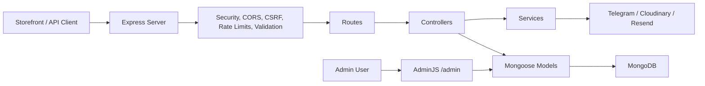
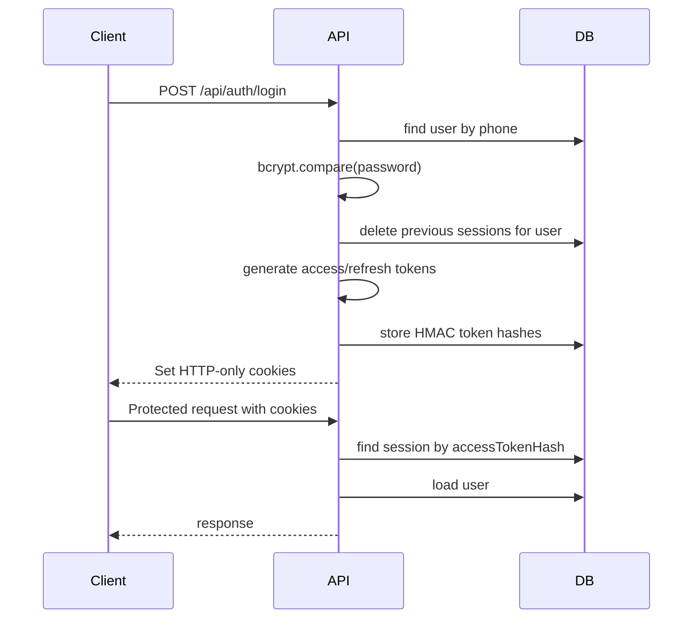

# Architecture Guide

Clothica Shop Backend is an Express/Mongoose application with a modular route-controller-service structure and an AdminJS back office.

## High-Level Flow



## Runtime Surfaces

| Surface | Location | Purpose |
| --- | --- | --- |
| Main API server | `src/server.js` | Express API, AdminJS mount, webhooks |
| Admin config | `src/admin/*` | AdminJS resources and authentication |
| Standalone admin runtime | `clothica-shop/src/*` | Separate AdminJS package sharing root models |
| Swagger config | `config/swagger.js` | OpenAPI generation |

## Layer Responsibilities

### Routes

Location: `src/routes`

Routes define:

- URL paths
- middleware order
- validation schemas
- controller binding
- Swagger comments

Routes should not contain business logic.

### Controllers

Location: `src/controllers`

Controllers handle:

- request/response mapping
- business operation orchestration
- model/service calls
- status codes

Controllers should keep input assumptions explicit and rely on validation middleware whenever possible.

### Services

Location: `src/services`

Services own reusable business or integration logic:

- session token creation and password hashing
- Telegram bot/webhook operations
- future cross-controller workflows

Services should avoid direct Express response handling.

### Middleware

Location: `src/middleware`

Middleware owns cross-cutting request concerns:

- authentication
- admin authorization
- request origin verification
- rate limiting
- logging
- upload validation
- centralized error responses

### Models

Location: `src/models`

Models define:

- MongoDB schema shape
- indexes
- validation constraints
- JSON serialization rules
- hooks where model-local consistency is needed

Sensitive fields should use `select: false` and be removed in `toJSON`.

### Validations

Location: `src/validations`

Celebrate/Joi schemas are the API contract boundary. Add or update schemas before allowing new request fields into controllers or Mongoose operations.

## Request Lifecycle

For a typical API request:

1. `logger`
2. Helmet/CORS/body parsers/cookie parser
3. i18n middleware
4. static assets
5. AdminJS route, if `/admin`
6. API rate limiter
7. CSRF Origin/Referer verification for mutating requests
8. route-level auth/admin/validation middleware
9. controller
10. not found handler
11. Celebrate errors
12. centralized error handler

## Authentication Lifecycle



## AdminJS Architecture

AdminJS is configured in `src/admin` and mounted in the main API server. The nested `clothica-shop` package is a standalone AdminJS runtime that imports the same root models/resources.

Admin password edits are protected by an AdminJS action hook in `src/admin/resources.js`, which hashes plaintext passwords before saving.

## Adding a New Endpoint

1. Add or update a Mongoose model if new persistence is needed.
2. Add a Joi schema in `src/validations`.
3. Add controller logic in `src/controllers`.
4. Add route and middleware order in `src/routes`.
5. Add Swagger comments to the route file.
6. Update `docs/API.md`.
7. Run:

```bash
npm run lint:check
npm run audit:security
```

## Adding a New Admin Resource

1. Import the model in `src/admin/resources.js`.
2. Add resource options, visibility rules and hooks.
3. Hide sensitive fields with `isVisible: false`.
4. If the standalone admin package should expose it, it will inherit root resources through `clothica-shop/src/admin/options.ts`.
5. Run:

```bash
cd clothica-shop
npm run build
npm run lint
```

## Design Principles

- Do not trust client totals, roles or ownership fields.
- Validate at route boundaries.
- Keep admin actions explicit and sensitive fields hidden.
- Avoid raw secrets in MongoDB or logs.
- Prefer additive migrations over destructive schema assumptions.
- Keep Swagger and Markdown docs in sync with behavior.
